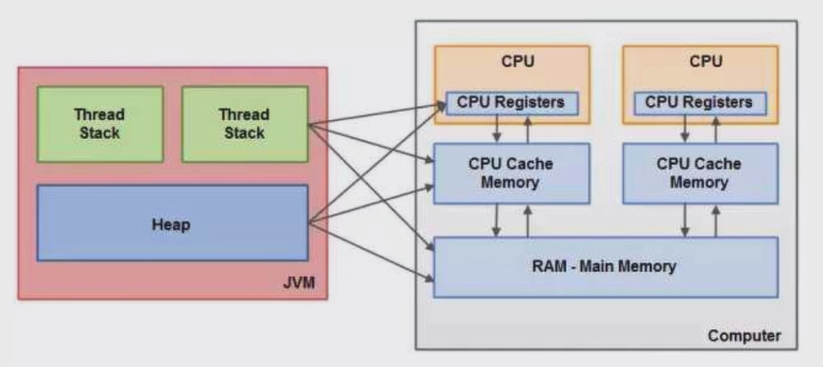

# 基本概念

## 并发

​	同时拥有两个或者多个线程,如果程序在单核上运行,多个线程将交替地换入或者换出内存,这些线程是同时"存在"的,每个线程都处于执行过程中的某个状态,如果运行在多核处理器上,此时,程序中的每个线程都将分配到一个处理器核上,因此可以同时运行,此时可以称作并行

​	**关注点:**多个线程操作相同的资源,保证线程安全,合理使用资源

## 高并发(High Concurrency)

​	高并发是互联网分布式架构设计必须考虑的因素之一,它通常指,通过设计保证系统能够**同时并行处理**很多请求

​	**关注点:**服务能够同时处理很多请求,提高程序性能

# 并发基础

## CPU多级缓存

### 概念

[参考博客](https://www.cnblogs.com/yanlong300/p/8986041.html):https://www.cnblogs.com/yanlong300/p/8986041.html

#### CPU cahe的意义:**

CPU在摩尔定律的指导下以每18个月翻一番的速度在发展，然而内存和硬盘的发展速度远远不及CPU。这就造成了高性能能的内存和硬盘价格及其昂贵。然而CPU的高度运算需要高速的数据。为了解决这个问题，CPU厂商在CPU中内置了少量的高速缓存以解决I\O速度和CPU运算速度之间的不匹配问题。

#### 实现的原理

* **时间局部性（Temporal Locality）**：如果一个信息项正在被访问，那么在近期它很可能还会被再次访问。
* **空间局部性（Spatial Locality）**：如果一个存储器的位置被引用，那么将来他附近的位置也会被引用。

### 带有高速缓存的CPU执行计算的流程

1. 程序以及数据被加载到主内存
2. 指令和数据被加载到CPU的高速缓存
3. CPU执行指令，把结果写到高速缓存
4. 高速缓存中的数据写回主内存

### 多核CPU多级缓存一致性协议MESI

多核CPU的情况下有多个一级缓存，如何保证缓存内部数据的一致,不让系统数据混乱。这里就引出了一个一致性的协议MESI。

#### MESI协议缓存状态

> **缓存行（Cache line）**:缓存存储数据的单元。

MESI 是指4中状态的首字母。每个Cache line有4个状态，可用2个bit表示，它们分别是：

| 状态                     | 描述                                                         | 监听任务                                                     |
| ------------------------ | ------------------------------------------------------------ | ------------------------------------------------------------ |
| M 修改 (Modified)        | 该Cache line有效，数据被修改了，和内存中的数据不一致，数据只存在于本Cache中。 | 缓存行必须时刻监听所有试图读该缓存行相对就主存的操作，这种操作必须在缓存将该缓存行写回主存并将状态变成S（共享）状态之前被延迟执行。 |
| E 独享、互斥 (Exclusive) | 该Cache line有效，数据和内存中的数据一致，数据只存在于本Cache中。 | 缓存行也必须监听其它缓存读主存中该缓存行的操作，一旦有这种操作，该缓存行需要变成S（共享）状态。 |
| S 共享 (Shared)          | 该Cache line有效，数据和内存中的数据一致，数据存在于很多Cache中。 | 缓存行也必须监听其它缓存使该缓存行无效或者独享该缓存行的请求，并将该缓存行变成无效（Invalid）。 |
| I 无效 (Invalid)         | 该Cache line无效。                                           | 无                                                           |

### 乱序执行优化

​	处理器为了提升运算速度,会对代码的执行顺序做出调整,违背原来的顺序.

## java内存模型(Java Memory Model,JMM)

​	[参考博客](https://www.cnblogs.com/yanlong300/p/9009687.html)

​	Java作为一个跨平台的语言，它的实现要面对不同的底层硬件系统，设计一个中间层模型来屏蔽底层的硬件差异，给上层的开发者一个一致的使用接口。Java内存模型就是这样一个中间层的模型，它为程序员屏蔽了底层的硬件实现细节，支持大部分的主流硬件平台

### 同步操作和规则

#### 八个同步操作

> **锁定（lock）**:作用于主内存中的变量，将他标记为一个线程独享变量。

通常意义上的上锁，就是一个线程正在使用时，其他线程必须等待该线程任务完成才能继续执行自己的任务。

> **解锁（unlock）**:作用于主内存中的变量，解除变量的锁定状态，被解除锁定状态的变量才能被其他线程锁定。

执行完成后解开锁。

> **read（读取）**：作用于主内存的变量，它把一个变量的值从主内存传输到线程的工作内存中，以便随后的load动作使用。

从主内存 读取到工作内存中。

> **load(载入)**：把read操作从主内存中得到的变量值放入工作内存的变量的副本中。

给工作内存中的副本赋值。

> **use(使用)**：把工作内存中的一个变量的值传给执行引擎，每当虚拟机遇到一个使用到变量的指令时都会使用该指令。

程序执行过程中读取该值时调用。

> **assign（赋值）**：作用于工作内存的变量，它把一个从执行引擎接收到的值赋给工作内存的变量，每当虚拟机遇到一个给变量赋值的字节码指令时执行这个操作。

将运算完成后的新值赋回给工作内存中的变量，相当于修改工作内存中的变量。

> **store（存储）**：作用于工作内存的变量，它把工作内存中一个变量的值传送到主内存中，以便随后的write操作使用。

将该值从变量中取出，写入工作内存中。

> **write（写入）**：作用于主内存的变量，它把store操作从工作内存中得到的变量的值放入主内存的变量中。

将工作内存中的值写回主内存。

#### 操作规则

- 不允许read和load、store和write操作之一单独出现，即不允许一个变量从主内存读取了但工作内存不接受，或者从工作内存发起回写了但主内存不接受的情况出现。
- 不允许一个线程丢弃它的最近的assign操作，即变量在工作内存中改变了之后必须把该变化同步回主内存。
- 不允许一个线程无原因地（没有发生过任何assign操作）把数据从线程的工作内存同步回主内存中。
- 一个新的变量只能在主内存中“诞生”，不允许在工作内存中直接使用一个未被初始化（load或assign）的变量，换句话说就是对一个变量实施use和store操作之前，必须先执行过了assign和load操作。
- 一个变量在同一个时刻只允许一条线程对其进行lock操作，但lock操作可以被同一条线程重复执行多次，多次执行lock后，只有执行相同次数的unlock操作，变量才会被解锁。
- 如果对一个变量执行lock操作，将会清空工作内存中此变量的值，在执行引擎使用这个变量前，需要重新执行load或assign操作初始化变量的值。
- 如果一个变量事先没有被lock操作锁定，则不允许对它执行unlock操作，也不允许去unlock一个被其他线程锁定住的变量。

#### 回顾

**1.Java内存模型是一个规范，他规定了不同线程如何以及何时可以看到其他线程写入共享变量的值以及如何在必要时同步对共享变量的访问。**

**2.java内存模型要求，调用栈和本地变量存储在线程栈上，对象存放在堆上。线程之间的通信必须要经过主内存。**

**3.定义了同步的八个操作，以及使用这八个操作需要遵守的规则。**

## 并发的优势和风险

