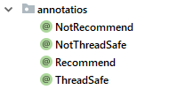
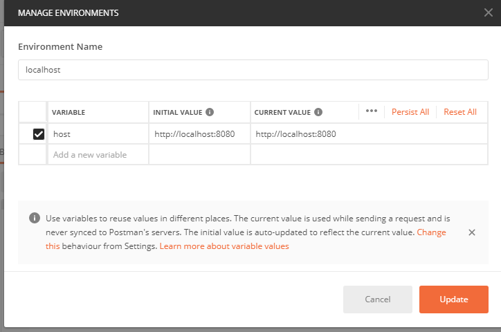
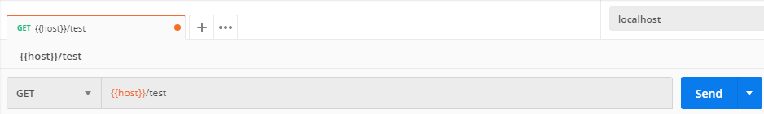
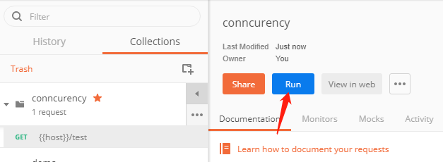
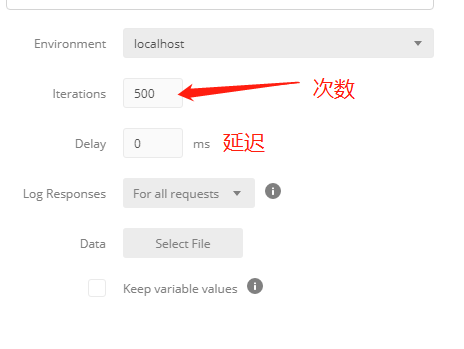
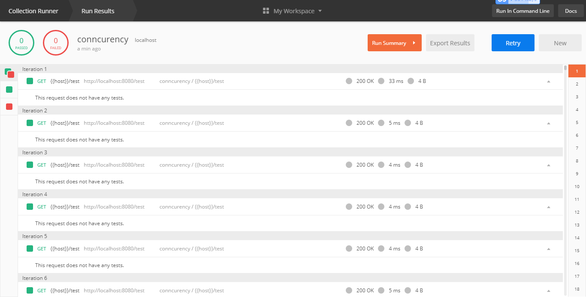
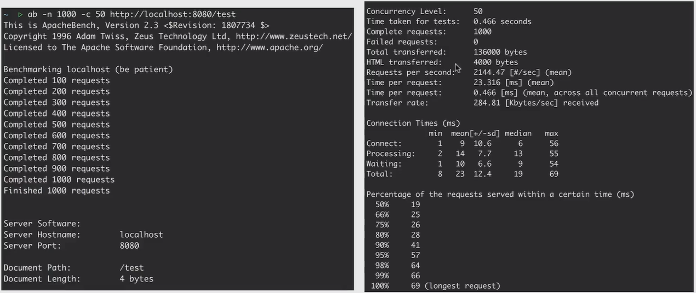
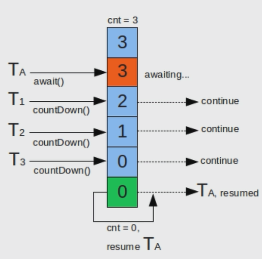

# 环境搭建和准备

## 新建四个案例用的注解



```
ThreadSafe:用来标记 [线程安全] 的类或者写法
NotThreadSafe:用来标记 [线程不安全] 的类或者写法
Recommend:用来标记 [推荐] 的类或者写法
NotRecommend:用来标记 [不推荐] 的类或者写法
```

## 并发模拟

### 工具

#### Postman:Http请求模拟工具

**技巧一**:设置环境变量,这样在不同的测试环境时,只需要修改环境变量就行了.很方便






**技巧二:**并发测试







#### Apache Bench(AB)

Apache附带的工具,测试网站新性能

```
linux
	安装:sudo apt-get install apache2-utils
```


```
ab -n 1000 -c 50 http://localhost:8080/test
-n:请求次数
-c:并发数

This is ApacheBench, Version 2.3 <$Revision: 1757674 $>
Copyright 1996 Adam Twiss, Zeus Technology Ltd, http://www.zeustech.net/
Licensed to The Apache Software Foundation, http://www.apache.org/
//apache版本信息
Benchmarking www.baidu.com (be patient).....done


Server Software: BWS/1.1
//请求返回header类型，可能是nginx、apache、IIs等
Server Hostname: www.baidu.com
//请求ip或者域名
Server Port: 443
//请求端口，当前请求为https所以端口为443，请求https端口80
SSL/TLS Protocol: TLSv1.2,ECDHE-RSA-AES128-GCM-SHA256,2048,128
//https端口协议
TLS Server Name: www.baidu.com

Document Path: /
//路径
Document Length: 227 bytes
//第一个成功返回的文档的字节大小
Concurrency Level: 10
//并发数！！！
Time taken for tests: 1.034 seconds
//从建立连接到最后接受完成总时间
Complete requests: 100
//总请求数成功的
Failed requests: 0
//失败的
Total transferred: 87200 bytes
//从服务器接收的字节总数
HTML transferred: 22700 bytes
//HTML接收字节数
Requests per second: 96.75 [#/sec] (mean)
————每秒请求数（总请求数/总时间）
Time per request: 103.359 [ms] (mean)
————用户平均请求等待时间=concurrency * timetaken * 1000 / done
参考Jmeter、LR中的平均响应时间
Time per request: 10.336 [ms] (mean, across all concurrent requests)
————服务器处理每个请求平均响应时间=timetaken * 1000 / done
Transfer rate: 82.39 [Kbytes/sec] received

Connection Times (ms)
min mean[+/-sd] median max
Connect: 41 75 16.1 74 121
Processing: 10 23 12.7 19 63
Waiting: 10 21 10.8 18 54
Total: 62 99 18.5 97 168
//网络连接情况
Percentage of the requests served within a certain time (ms)
50% 97
66% 104
75% 107
80% 110
90% 126
95% 138
98% 148
99% 168
100% 168 (longest request)
//整体响应时间的分布比
--------------------- 
作者：__wuxi 
来源：CSDN 
原文：https://blog.csdn.net/wx19900503/article/details/56847264 
版权声明：本文为博主原创文章，转载请附上博文链接！
```




#### JMeter

Apache组织开发的压力测试工具


#### 代码

Semaphore, CountDownLatch等

##### CountDownLatch

​	利用它可以实现类似计数器的功能。比如有一个任务A，它要等待其他4个任务执行完毕之后才能执行，此时就可以利用CountDownLatch来实现这种功能了



##### Semaphore

​	Semaphore翻译成字面意思为 信号量，Semaphore可以控同时访问的线程个数，通过 acquire() 获取一个许可，如果没有就等待，而 release() 释放一个许可。

##### demo

```java
@Slf4j
@NotThreadSafe
public class ConcurrencyTest {
    //请求总数
    public static int clientTotal = 5000;
    //同时并发执行的线程数
    public static int threadTotal = 200;
    //计数
    public static int count = 0;

    public static void main(String[] args) throws InterruptedException {
        ExecutorService executorService = Executors.newCachedThreadPool();
        //给定并发的数
        final Semaphore semaphore = new Semaphore(threadTotal);
        //只有当clientTotal到0的时候才去执行别的代码
        final CountDownLatch countDownLatch = new CountDownLatch(clientTotal);

        for (int i = 0; i < clientTotal; i++) {
            //线程池执行
            executorService.execute(() ->{
                try {
                    //每次执行需要获取值,判断是否能执行,如果到一定的数量时,将会阻塞
                    semaphore.acquire();
                    add();
                    semaphore.release();
                } catch (Exception e) {
                    log.error("error", e);
                }
                //执行完一个,计数值减一
                countDownLatch.countDown();
            });

        }
        //保证请求执行完
        countDownLatch.await();
        executorService.shutdown();
        log.info("count:{}",count);
    }

    private static void add() {
        count++;
    }
}
```

