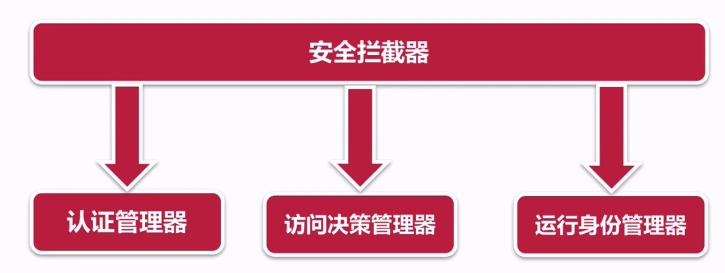
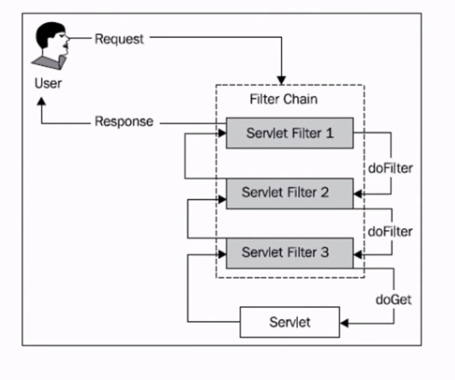
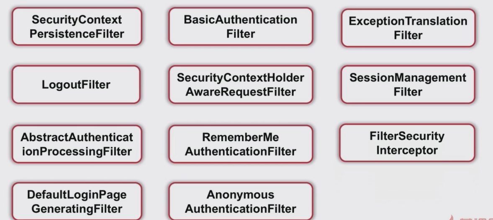
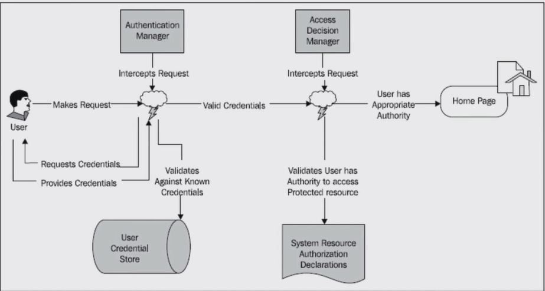

# Spring Security

## 介绍

​	Spring Security是一个能够为基于Spring的企业应用系统提供声明式的安全访问控制解决方案的安全框架。它提供了一组可以在Spring应用上下文中配置的Bean，充分利用了Spring IoC，DI（控制反转Inversion of Control ,DI:Dependency Injection 依赖注入）和AOP（面向切面编程）功能，为应用系统提供声明式的安全访问控制功能，减少了为企业系统安全控制编写大量重复代码的工作

## 优点

人们使用Spring Security有很多种原因，不过通常吸引他们的是在J2EE Servlet规范或EJB规范中找不到典型企业应用场景的解决方案。

特别要指出的是他们不能在WAR 或 EAR 级别进行移植。

这样，如果更换服务器环境，就要，在新的目标环境进行大量的工作，对应用系统进行重新配置安全。

使用Spring Security 解决了这些问题，也提供很多有用的，完全可以指定的其他安全特性。

主要组件图:

​	spring security提供了很多的过滤器,拦截了servlet请求,转交给上述的认证管理器,访问决策管理器,并强制安全性,认证用户身份和用户权限,以达到保护web资源的目的.

​	spring security安全机制主要包括两个部分, 

​		认证:是为用户建立一个他所声明的主体。主体一般是指用户，设备或可以在系统中执行动作的其他系统

​		验证(权限控制):指的是一个用户能否在应用中执行某个操作，在到达授权判断之前，身份的主体已经由身份验证过程建立

​	这些概念是通用的，不是Spring Security特有的。

## Spring Security 提供的一套验证功能。

### HTTP BASIC authentication headers (一个基于IEFT RFC 的标准)

Basic 认证是HTTP 中非常简单的认证方式，因为简单，所以不是很安全，不过仍然非常常用。

当一个客户端向一个需要认证的HTTP服务器进行数据请求时，如果之前没有认证过，HTTP服务器会返回401状态码，要求客户端输入用户名和密码。用户输入用户名和密码后，用户名和密码会经过BASE64加密附加到请求信息中再次请求HTTP服务器，HTTP服务器会根据请求头携带的认证信息，决定是否认证成功及做出相应的响应。

### HTTP Digest authentication headers (一个基于IEFT RFC 的标准)

①浏览器发送http报文请求一个受保护的资源。

②服务端的web容器将http响应报文的响应码设为401，响应头部比Basic模式复杂，WWW-Authenticate: Digest realm=”myTomcat”,qop="auth",nonce="xxxxxxxxxxx",opaque="xxxxxxxx" 。其中qop的auth表示鉴别方式；nonce是随机字符串；opaque服务端指定的值，客户端需要原值返回。

③浏览器弹出对话框让用户输入用户名和密码，浏览器对用户名、密码、nonce值、HTTP请求方法、被请求资源URI等组合后进行MD5运算，把计算得到的摘要信息发送给服务端。请求头部类似如下，Authorization: Digest username="xxxxx",realm="myTomcat",qop="auth",nonce="xxxxx",uri="xxxx",cnonce="xxxxxx",nc=00000001,response="xxxxxxxxx",opaque="xxxxxxxxx" 。其中username是用户名；cnonce是客户端生成的随机字符串；nc是运行认证的次数；response就是最终计算得到的摘要。

④服务端web容器获取HTTP报文头部相关认证信息，从中获取到username，根据username获取对应的密码，同样对用户名、密码、nonce值、HTTP请求方法、被请求资源URI等组合进行MD5运算，计算结果和response进行比较，如果匹配则认证成功并返回相关资源，否则再执行②，重新进行认证。

⑤以后每次访问都要带上认证头部。

其实通过哈希算法对通信双方身份的认证十分常见，它的好处就是不必把具备密码的信息对外传输，只需将这些密码信息加入一个对方给定的随机值计算哈希值，最后将哈希值传给对方，对方就可以认证你的身份。Digest思想同样采如此，用了一种nonce随机数字符串，双方约好对哪些信息进行哈希运算即可完成双方身份的验证。Digest模式避免了密码在网络上明文传输，提高了安全性，但它仍然存在缺点，例如认证报文被攻击者拦截到攻击者可以获取到资源。

### HTTP X.509 client certificate exchange (一个基于IEFT RFC 的标准)

### LDAP (一个非常常见的跨平台认证需要做法，特别是在大环境)

​	LDAP协议是跨平台的和标准的协议，因此应用程序就不用为LDAP目录放在什么样的[服务器](https://baike.baidu.com/item/%E6%9C%8D%E5%8A%A1%E5%99%A8)上操心了。实际上，LDAP得到了业界的广泛认可，因为它是Internet的标准。厂商都很愿意在产品中加入对LDAP的支持，因为他们根本不用考虑另一端（客户端或服务端）是怎么样的。LDAP服务器可以是任何一个[开放源代码](https://baike.baidu.com/item/%E5%BC%80%E6%94%BE%E6%BA%90%E4%BB%A3%E7%A0%81)或商用的LDAP目录服务器（或者还可能是具有LDAP界面的关系型数据库），因为可以用同样的协议、客户端连接软件包和查询命令与LDAP服务器进行交互。与LDAP不同的是，如果软件厂商想在软件产品中集成对DBMS的支持，那么通常都要对每一个[数据库服务器](https://baike.baidu.com/item/%E6%95%B0%E6%8D%AE%E5%BA%93%E6%9C%8D%E5%8A%A1%E5%99%A8)单独定制。不象很多商用的关系型数据库，你不必为LDAP的每一个客户端连接或许可协议付费。大多数的LDAP[服务器](https://baike.baidu.com/item/%E6%9C%8D%E5%8A%A1%E5%99%A8)安装起来很简单，也容易维护和优化。

### Form-based authentication (提供简单[用户接口](https://baike.baidu.com/item/%E7%94%A8%E6%88%B7%E6%8E%A5%E5%8F%A3)的需求)

## spring security-权限拦截

​	spring security提供了很多的过滤器,拦截了servlet请求,转交给认证管理器,访问决策管理器,并强制安全性,认证用户身份和用户权限,以达到保护web资源的目的.

### Filter

### Spring Security-数据库管理

