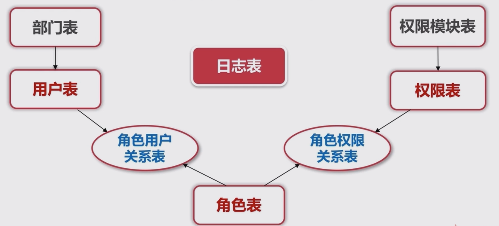

# RBAC模型(Role-Based Access Control)

​	基于角色的权限访问控制（Role-Based Access Control）作为传统访问控制（自主访问，强制访问）的有前景的代替受到广泛的关注。在RBAC中，权限与角色相关联，用户通过成为适当角色的成员而得到这些角色的权限。这就极大地简化了权限的管理。在一个组织中，角色是为了完成各种工作而创造，用户则依据它的责任和资格来被指派相应的角色，用户可以很容易地从一个角色被指派到另一个角色。角色可依新的需求和系统的合并而赋予新的权限，而权限也可根据需要而从某角色中回收。角色与角色的关系可以建立起来以囊括更广泛的客观情况。

# 基本目标

* 基于拓展的RBAC实现
* 易于拓展,能灵活适应需求的变化
* 所有管理都有界面方便操作

# 内容

## 配置管理类功能

* 用户,权限,角色的管理界面(扩展用:部门,权限模块)
* 角色-用户管理, 角色-权限管理
* 权限更新日志管理

## 权限拦截类功能

* 在切面(Filter)做权限拦截
* 确定某个用户是否拥有权限

## 辅助类功能:缓存(Redis),各种树结构生成

* 缓存(Redis)的封装和使用
* 各种树的构建:部门树,权限模块树,角色权限树,用户权限树
* 权限操作恢复

# 详细表结构设计



## 注意点

* 每个表都有自己的主键
* 字段尽量定义为NOT NULL(因为NULL创建索引的时候会占多多一个字节,如果是索引字段,一定要定义为not null)
* 尽量为每个字段添加备注
* 数据库字段统一小写,单词用下划线分开
* 使用InnoDB存储引擎
* 可以使用varchar的字段尽量不要使用text,bolb类型
* 使用UTF-8

## 用户表

```sql
CREATE TABLE `sys_user` (
    `id`  int NOT NULL AUTO_INCREMENT COMMENT '用户id' ,
    `username`  varchar(20) NOT NULL DEFAULT '' COMMENT '用户姓名' ,
    `telephone`  varchar(13) NOT NULL DEFAULT '' COMMENT '手机号' ,
    `mail`  varchar(20) NOT NULL DEFAULT '' COMMENT '邮箱' ,
    `password`  varchar(40) NOT NULL DEFAULT '' COMMENT '加密后的密码' ,
    `dept_id`  int NOT NULL DEFAULT 0 COMMENT '用户所在部门的id' ,
    `status`  int NOT NULL DEFAULT 1 COMMENT '状态, 1: 正常, 0: 冻结, 2: 删除' ,
    `remark`  varchar(200) NULL DEFAULT '' COMMENT '备注' ,
    `operator`  varchar(20) NOT NULL DEFAULT '' COMMENT '操作者' ,
    `operate_time`  datetime NOT NULL DEFAULT now() COMMENT '最后一次更新时间' ,
    `operate_ip`  varchar(20) NOT NULL DEFAULT '' COMMENT '最后一次更新操作者的IP地址' ,
    PRIMARY KEY (`id`)
);


```


## 部门表

```sql
CREATE TABLE `sys_dept` (
    `id`  int NOT NULL AUTO_INCREMENT COMMENT '部门id' ,
    `name`  varchar(20) NOT NULL DEFAULT '' COMMENT '部门名称' ,
    `parent_id`  int NOT NULL DEFAULT 0 COMMENT '上级部门的ID' ,
    `level`  varchar(20) NOT NULL DEFAULT '' COMMENT '部门的层级' ,
    `seq`  int NOT NULL DEFAULT 0 COMMENT '部门在当前层级的排序,从小到大' ,
    `remark`  varchar(200) NULL DEFAULT '' COMMENT '备注' ,
    `operator`  varchar(20) NOT NULL DEFAULT '' COMMENT '操作者' ,
    `operate_time`  datetime NOT NULL DEFAULT now() COMMENT '最后一次更新的时间' ,
    `operate_ip`  varchar(20) NOT NULL DEFAULT '' COMMENT '最后一次操作者的IP' ,
    PRIMARY KEY (`id`)
)
;
```

## 权限模块表

```sql
CREATE TABLE `sys_acl_module` (
    `id`  int(11) NOT NULL AUTO_INCREMENT COMMENT '权限模块id' ,
    `name`  varchar(20) CHARACTER SET utf8 COLLATE utf8_general_ci NOT NULL DEFAULT '' COMMENT '权限模块名称' ,
    `parent_id`  int(11) NOT NULL DEFAULT 0 COMMENT '上级权限模块的ID' ,
    `level`  varchar(20) CHARACTER SET utf8 COLLATE utf8_general_ci NOT NULL DEFAULT '' COMMENT '权限模块的层级' ,
    `seq`  int(11) NOT NULL DEFAULT 0 COMMENT '权限模块在当前层级的排序,从小到大' ,
    `status`  int(11) NOT NULL DEFAULT 1 COMMENT '状态, 1: 正常, 0: 冻结 ' ,
    `remark`  varchar(200) CHARACTER SET utf8 COLLATE utf8_general_ci NULL DEFAULT '' COMMENT '备注' ,
    `operator`  varchar(20) CHARACTER SET utf8 COLLATE utf8_general_ci NOT NULL DEFAULT '' COMMENT '操作者' ,
    `operate_time`  datetime NOT NULL DEFAULT CURRENT_TIMESTAMP COMMENT '最后一次更新的时间' ,
    `operate_ip`  varchar(20) CHARACTER SET utf8 COLLATE utf8_general_ci NOT NULL DEFAULT '' COMMENT '最后一次操作者的IP' ,
    PRIMARY KEY (`id`)
)
ENGINE=InnoDB
DEFAULT CHARACTER SET=utf8 COLLATE=utf8_general_ci
AUTO_INCREMENT=1
ROW_FORMAT=DYNAMIC
;
```

## 权限表

```sql
CREATE TABLE `sys_acl` (
    `id`  int(11) NOT NULL AUTO_INCREMENT ,
    `code`  varchar(20) CHARACTER SET utf8 COLLATE utf8_general_ci NOT NULL DEFAULT '' COMMENT '权限码' ,
    `name`  varchar(20) CHARACTER SET utf8 COLLATE utf8_general_ci NULL DEFAULT '' COMMENT '权限名称' ,
    `acl_module_id`  int(11) NOT NULL DEFAULT 0 COMMENT '权限所在权限模块的ID' ,
    `url`  varchar(100) CHARACTER SET utf8 COLLATE utf8_general_ci NOT NULL DEFAULT '' COMMENT '请求的url,可以填正则表达式' ,
    `type`  int(11) NOT NULL DEFAULT 1 COMMENT '类型 1: 菜单 2: 按钮 3: 其他' ,
    `status`  int(11) NOT NULL DEFAULT 1 COMMENT '状态 1: 正常, 0: 冻结' ,
    `seq`  int(11) NOT NULL DEFAULT 0 COMMENT '权限在当前模块下的顺序' ,
    `remark`  varchar(200) CHARACTER SET utf8 COLLATE utf8_general_ci NULL DEFAULT '' COMMENT '备注' ,
    `operator`  varchar(20) CHARACTER SET utf8 COLLATE utf8_general_ci NOT NULL DEFAULT '' COMMENT '操作者' ,
    `operate_time`  datetime NOT NULL DEFAULT CURRENT_TIMESTAMP COMMENT '最后一次更新的时间' ,
    `operate_ip`  varchar(20) CHARACTER SET utf8 COLLATE utf8_general_ci NOT NULL DEFAULT '' COMMENT '最后一次更新操作者的IP' ,
    PRIMARY KEY (`id`)
)
ENGINE=InnoDB
DEFAULT CHARACTER SET=utf8 COLLATE=utf8_general_ci
AUTO_INCREMENT=1
ROW_FORMAT=DYNAMIC
;


```

## 角色相关表

```sql
CREATE TABLE `sys_role_user` (
    `id`  int(11) NOT NULL AUTO_INCREMENT ,
    `role_id`  int(11) NOT NULL COMMENT '角色id' ,
    `user_id`  int(11) NOT NULL COMMENT '用户id' ,
    `operator`  varchar(20) CHARACTER SET utf8 COLLATE utf8_general_ci NOT NULL DEFAULT '' COMMENT '操作者' ,
    `operate_time`  datetime NOT NULL DEFAULT CURRENT_TIMESTAMP COMMENT '最后一次更新时间' ,
    `operate_ip`  varchar(20) CHARACTER SET utf8 COLLATE utf8_general_ci NOT NULL DEFAULT '' COMMENT '最后一次更新操作者的IP' ,
    PRIMARY KEY (`id`)
)
ENGINE=InnoDB
DEFAULT CHARACTER SET=utf8 COLLATE=utf8_general_ci
AUTO_INCREMENT=1
ROW_FORMAT=DYNAMIC
;
```

```sql
CREATE TABLE `sys_role_acl` (
    `id`  int(11) NOT NULL AUTO_INCREMENT ,
    `role_id`  int(11) NOT NULL COMMENT '角色id' ,
    `acl_id`  int(11) NOT NULL COMMENT '权限id' ,
    `operator`  varchar(20) CHARACTER SET utf8 COLLATE utf8_general_ci NOT NULL DEFAULT '' COMMENT '操作者' ,
    `operate_time`  datetime NOT NULL DEFAULT CURRENT_TIMESTAMP COMMENT '最后一次更新时间' ,
    `operate_ip`  varchar(20) CHARACTER SET utf8 COLLATE utf8_general_ci NOT NULL DEFAULT '' COMMENT '最后一次更新操作者的IP' ,
    PRIMARY KEY (`id`)
)
ENGINE=InnoDB
DEFAULT CHARACTER SET=utf8 COLLATE=utf8_general_ci
AUTO_INCREMENT=1
ROW_FORMAT=DYNAMIC
;
```

## 权限相关更新记录表

**只能查询,插入,操作状态的修改**

```sql
CREATE TABLE `sys_log` (
    `id`  int(11) NOT NULL AUTO_INCREMENT ,
    `type`  int(11) NOT NULL DEFAULT 0 COMMENT '权限更新的类型, 1: 部门, 2: 用户, 3:权限模块 4: 权限, 5: 角色, 6: 角色用户关系 7: 角色权限关系' ,
    `target_id`  int(11) NOT NULL COMMENT '基于type指定的对象id,比如用户,权限,角色表的主键' ,
    `old_value`  text CHARACTER SET utf8 COLLATE utf8_general_ci NULL COMMENT '旧值' ,
    `new_value`  text CHARACTER SET utf8 COLLATE utf8_general_ci NULL COMMENT '新值' ,
    `operator`  varchar(20) CHARACTER SET utf8 COLLATE utf8_general_ci NOT NULL DEFAULT '' COMMENT '操作者' ,
    `operate_time`  datetime NOT NULL DEFAULT CURRENT_TIMESTAMP COMMENT '最后一次更新时间' ,
    `operate_ip`  varchar(20) CHARACTER SET utf8 COLLATE utf8_general_ci NOT NULL DEFAULT '' COMMENT '最后一次更新操作者的IP' ,
    `status`  int(11) NOT NULL DEFAULT 0 COMMENT '当前是否复原过 0: 没有, 1: 复原过' ,
    PRIMARY KEY (`id`)
)
ENGINE=InnoDB
DEFAULT CHARACTER SET=utf8 COLLATE=utf8_general_ci
AUTO_INCREMENT=1
ROW_FORMAT=DYNAMIC
;
```

# Spring MVC 环境搭建

## maven依赖

```html
<properties>
        <springframework.version>4.3.10.RELEASE</springframework.version>
    </properties>

    <dependencies>
        <dependency>
            <groupId>junit</groupId>
            <artifactId>junit</artifactId>
            <version>4.11</version>
            <scope>test</scope>
        </dependency>

        <dependency>
            <groupId>org.springframework</groupId>
            <artifactId>spring-beans</artifactId>
            <version>${springframework.version}</version>
        </dependency>
        <dependency>
            <groupId>org.springframework</groupId>
            <artifactId>spring-context</artifactId>
            <version>${springframework.version}</version>
        </dependency>
        <!--spring mvc + web-->
        <dependency>
            <groupId>org.springframework</groupId>
            <artifactId>spring-web</artifactId>
            <version>${springframework.version}</version>
        </dependency>
        <dependency>
            <groupId>org.springframework</groupId>
            <artifactId>spring-webmvc</artifactId>
            <version>${springframework.version}</version>
        </dependency>
        <dependency>
            <groupId>org.springframework</groupId>
            <artifactId>spring-jdbc</artifactId>
            <version>${springframework.version}</version>
        </dependency>

        <!--mybatis-->
        <dependency>
            <groupId>org.mybatis</groupId>
            <artifactId>mybatis</artifactId>
            <version>3.4.0</version>
        </dependency>
        <dependency>
            <groupId>org.mybatis</groupId>
            <artifactId>mybatis-spring</artifactId>
            <version>1.2.3</version>
        </dependency>

        <!--druid-->
        <dependency>
            <groupId>com.alibaba</groupId>
            <artifactId>druid</artifactId>
            <version>1.0.20</version>
        </dependency>

        <!--mysql-->
        <dependency>
            <groupId>mysql</groupId>
            <artifactId>mysql-connector-java</artifactId>
            <version>5.1.30</version>
        </dependency>

        <!--lombok-->
        <dependency>
            <groupId>org.projectlombok</groupId>
            <artifactId>lombok</artifactId>
            <version>1.16.12</version>
        </dependency>

        <!--Jackson-->
        <dependency>
            <groupId>com.fasterxml.jackson.datatype</groupId>
            <artifactId>jackson-datatype-guava</artifactId>
            <version>2.5.3</version>
        </dependency>
    </dependencies>
```

## 配置文件配置

### / 和 /*的区别

* **/** 只会匹配到/hello /sss 等不带后缀的url, 但是能够拦截到静态资源,如 /xx.js /xx.css
* **/*** 则会匹配到所有的url,路径型和有后缀型的 包括/xxx.jsp /xxx.html等,应用在过滤器的编码上

### web.xml

```html
<?xml version="1.0" encoding="UTF-8"?>
<web-app>
    <display-name>Archetype Created Web Application</display-name>

    <listener>
        <listener-class>org.springframework.web.context.ContextLoaderListener</listener-class>
    </listener>
    <!--spring beans 配置文件所在目录-->
    <context-param>
        <param-name>contextConfigLocation</param-name>
        <param-value>classpath:applicationContext.xml</param-value>
    </context-param>


    <!--spring mvc 配置-->
    <!--加了classpath后是到项目目录查找,如果不加,则到WEB-INF找,还有spring会默认匹配spring-sevlet.xml-->
    <servlet>
        <servlet-name>spring</servlet-name>
        <servlet-class>org.springframework.web.servlet.DispatcherServlet</servlet-class>
    </servlet>
    <servlet-mapping>
        <servlet-name>spring</servlet-name>
        <url-pattern>/</url-pattern>
    </servlet-mapping>

    <!--编码-->
    <filter>
        <filter-name>encodingFilter</filter-name>
        <filter-class>org.springframework.web.filter.CharacterEncodingFilter</filter-class>
        <init-param>
            <param-name>encoding</param-name>
            <param-value>UTF-8</param-value>
        </init-param>
        <init-param>
            <param-name>forceEncoding</param-name>
            <param-value>true</param-value>
        </init-param>
    </filter>
    <filter-mapping>
        <filter-name>encodingFilter</filter-name>
        <url-pattern>/*</url-pattern>
    </filter-mapping>

    <welcome-file-list>
        <welcome-file>index.jsp</welcome-file>
    </welcome-file-list>
</web-app>
```

applicationContext.xml

### spring-servlet.xml

```xml
<?xml version="1.0" encoding="UTF-8"?>
<beans xmlns="http://www.springframework.org/schema/beans"
       xmlns:xsi="http://www.w3.org/2001/XMLSchema-instance"
       xmlns:context="http://www.springframework.org/schema/context"
       xmlns:mvc="http://www.springframework.org/schema/mvc"
       xsi:schemaLocation="http://www.springframework.org/schema/beans http://www.springframework.org/schema/beans/spring-beans.xsd http://www.springframework.org/schema/context http://www.springframework.org/schema/context/spring-context.xsd http://www.springframework.org/schema/mvc http://www.springframework.org/schema/mvc/spring-mvc.xsd">

    <context:annotation-config/>

    <!--启动注解驱动的spring mvc功能-->
    <mvc:annotation-driven/>

    <!--启动包扫描的功能-->
    <context:component-scan base-package="com.deng.controller"/>
    <context:component-scan base-package="com.deng.service"/>

    <bean class="org.springframework.web.servlet.mvc.method.annotation.RequestMappingHandlerMapping"/>

    <bean class="org.springframework.web.servlet.view.BeanNameViewResolver"/>

    <bean id="jsonView" class="org.springframework.web.servlet.view.json.MappingJackson2JsonView"/>

    <bean class="org.springframework.web.servlet.view.InternalResourceViewResolver">
        <property name="prefix" value="/views"/>
        <property name="suffix" value=".jsp"/>
    </bean>

</beans>
```

### logback

#### 级别

TRACE < DEBUG < INFO < WARN < ERROR

