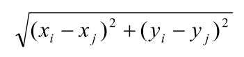

# 分治与递归

## 递归

* 直接或间接地调用自身的算法称为 递归算法 。
* 用函数自身给出定义的函数称为 递归函数

## 分治

### 思想

分治法的设计思想是，将一个难以直接解决的大问题，分割成一些规模较小的相同子问题，以便 各个击破，分而治之 ，而后将子问题解合并

1. 将要求解的较大规模的问题分割成k k 个更小规模的子问题

2. 对这 k 个子问题分别求解。如果子问题的规模仍然不够小，则再划分为k k 个子问题，如此递归的进行下去，直到问题规模足够小，很容易求出其解为止

3.  将 求出的小规模的问题的解合并为一个更大规模的问题的解，自底向上逐步求出原来问题的解

### 模板

```
divide-and-conquer(P)
{
if ( | P | <= n0) adhoc(P); //解决小规模的问题
	divide P into smaller subinstances P1,P2,...,Pk；//分解问题
for (i=1,i<=k,i++)
	yi=divide-and-conquer(Pi); //递归的解各子问题
return merge(y1,...,yk); //将各子问题的解合并为原问题的解
}
```


### 注意

 	1. 在用分治法设计算法时，最好**使子问题的规模大致相同**。即将一个问题分成大小相等的k个子问题的处理方法是行之有效的。这种使子问题规模大致相等的做法是出自一种 **平衡(balancing)子问题的思想**，它几乎总是比子问题规模不等的做法要好。
 	2. **划分均匀**效率更高

### 如何降低复杂度

1. 代数变换,减少子问题个数
2. 预处理, 即尽可能将递归算法中的处理步骤, 放置在调用递归算法之前,俗称**剪枝**

## 例子

### 大整数乘法

### 线性时间的选择问题

​	给定线性序集中n 个元素和一个整数k ，1≤k≤n ，要求找出这n 个元素中第k小的元素

#### 解决方案

1. **排序法** O(nlogn)

2. **堆 + 部分排序**  O(n+ k * logn)

    先建 最小堆 ：O(n)弹堆顶元素k 次，第k 次获得第k 小元素：k*O(logn)

   当k 较小，接近线性效率，但堆的空间较大。

3. **堆** O(n * logk)
    先建一个长度为k 的 最大堆 ，存储n 个元素的前k 个元素，并假设他们就是最小的k 个数，建堆费时O(k) ；
    弹堆顶x ，将后续n-k 个元素逐个遍历，和堆顶x 比较，若比x 小，插入并更新堆，若比x 大，丢弃；总耗时最坏：O(k+(n-k)logk) = O(nlogk) ，当k 较小，接近线性效率， 且堆的空间很小( 只有k) ，适合于海量数据查询第k 小元素(k<<n) 。 此方法得益于在堆中，插入、查找等各项操作时间复杂度均为logk

4. **快速选择算法** .最坏情况：O(n) ，但此处n

   ```c++
   template<class Type>
   Type RandomizedSelect(Type a[],int p,int r,int k)
   {
   if (p==r) return a[p];
   int i=RandomizedPartition(a,p,r),
   j=i-p+1;
   if (k<=j) return RandomizedSelect(a,p,i,k);
   else return RandomizedSelect(a,i+1,r,k-j);
   }
   
   在最坏情况下，算法randomizedSelect 需要O(n 2 ) 计算时间。
   但只要适当选择基准值，可以证明算法randomizedSelect 可以
   在O(n) 平均时间内找出n 个输入元素中的第k
   ```


### 最接近点对问题

给定平面上n 个点的集合S ，找其中的一对点，使得在n 个点组成的所有点对中，该点对间的距离最小。
n 个点(xi, yi) (1≤i≤n) ，两点间距离公式如下：



