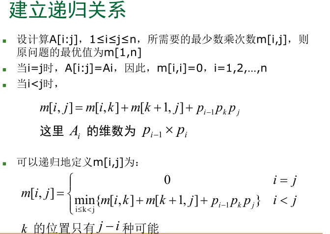
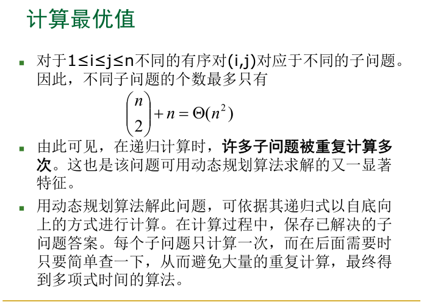
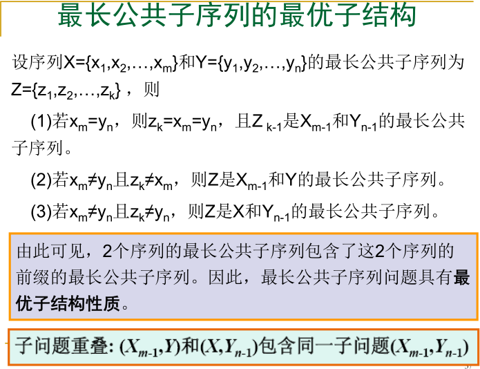
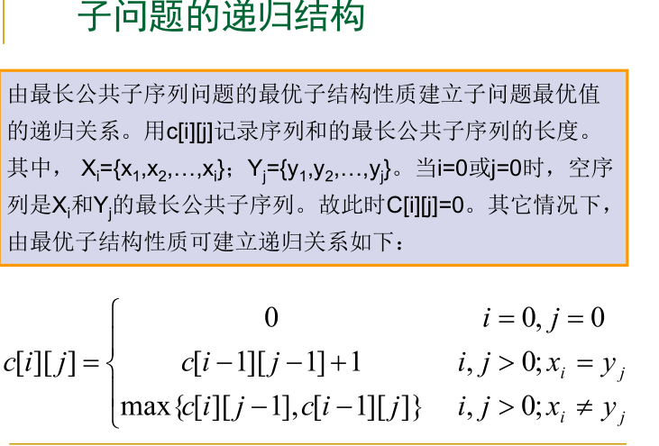
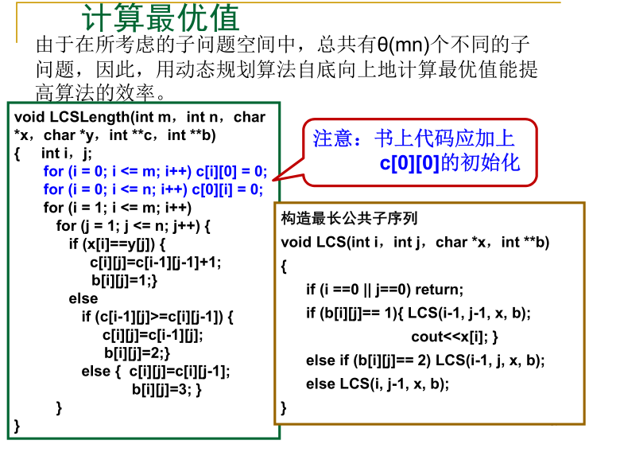
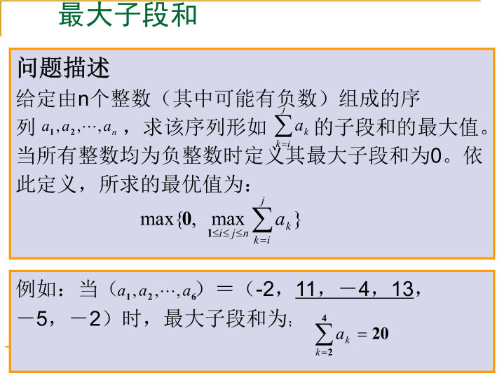
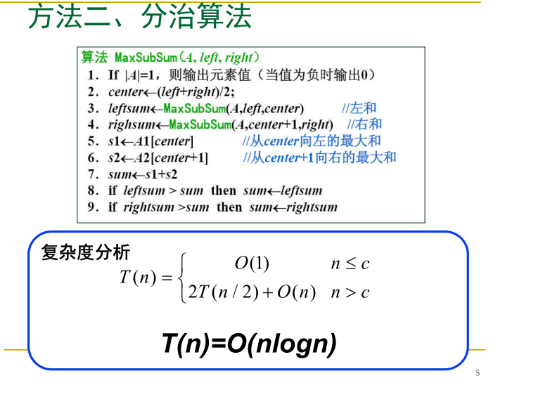
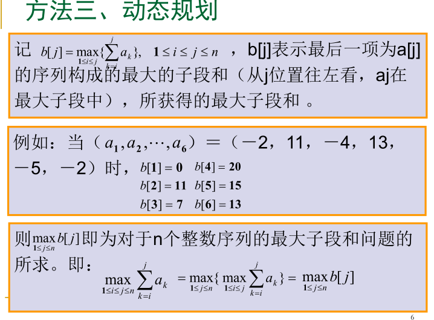
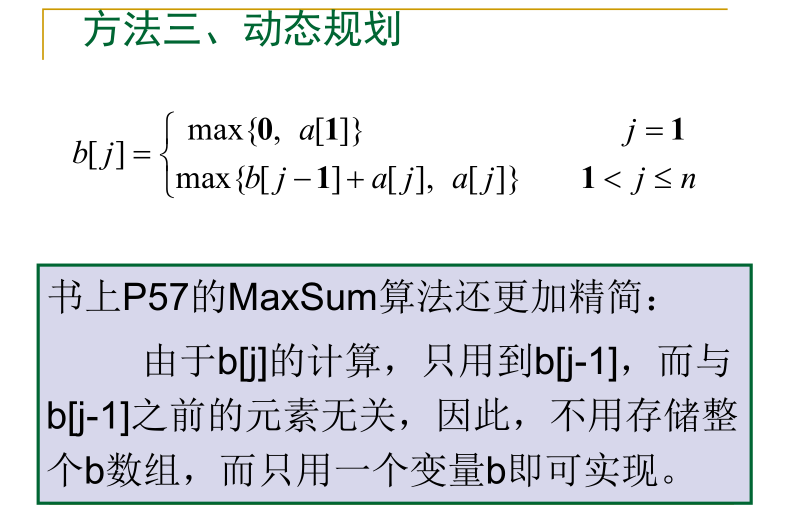

# 动态规划

## 基本要素

掌握动态规划算法的基本要素
（1 ）最优子结构性质
（2 ）重叠子问题性质

## 解题步骤

（1 ）找出最优解的性质，并刻划其结构特征。
（2 ）递归地定义最优值。
（3 ）以自底向上的方式计算出最优值。
（4 ）根据计算最优值时得到的信息，构造最优解。


## **斐波那契数列**

**F(0) = 1 F(1)  = 1, F(n) = F(n-1)+F(n-2)**

## 记忆化搜索-自上向下的解决问题

```c++
//记忆化搜索-自上向下的解决问题,复杂度O(n)
vector<int> memo;
int fib(int n){
    if(n == 0)
        return 0;
    if(n == 1)
        return 1;
    if(memo[n] == -1)//因为初始值不可能小于0,所以可以设置为-1
        //通过memo把已经计算过的数保存好来,直接可以通过memo判断
        //达到每个数只计算一次,
        memo[n] = fib(n-1) + fib(n-2);
    return memo[n];
}
```

## 动态规划-自下而上的解决问题

```c++
//时间复杂度也为O(n),使用动态规划,可以避免递归所消耗的性能,
//因为递归是需要占用系统的栈空间的
int fib(int n){
    vector<int> memo(n+1,-1);
    memo[0] = 0;
    memo[1] = 1;
    //真正意义上只遍历了一次.递归实际还要判断.所以每个访问了许多次
    for(int i = 2; i <= n ;i++)
        memo[i] = memo[i-1]+memo[i-2];
    return memo[n];
}
```


## 定义

将原问题拆解成若干子问题,同时保存子问题的答案,使得每个子问题只求解一次,最终获得原问题的答案


#### 动态规划

递归问题 

​	--> 重叠子问题  

​		-->记忆化搜索,自定向下的解决问题,比较容易思考

​			记忆化搜索可以用动态规划解决

​		-->动态规划,自底向上的解决问题


## 动态规划问题

### 70. Climing Stairs

假设你正在爬楼梯。需要 *n* 阶你才能到达楼顶。

每次你可以爬 1 或 2 个台阶。你有多少种不同的方法可以爬到楼顶呢？

**注意：**给定 *n* 是一个正整数。

**示例 1：**

```
输入： 2
输出： 2
解释： 有两种方法可以爬到楼顶。
1.  1 阶 + 1 阶
2.  2 阶
```

**示例 2：**

```
输入： 3
输出： 3
解释： 有三种方法可以爬到楼顶。
1.  1 阶 + 1 阶 + 1 阶
2.  1 阶 + 2 阶
3.  2 阶 + 1 阶
```

**思路**

```java
/**
	自顶向下:
	当输入为n阶台阶,有两个分支,
		一个是走一步 n-1
		一个是走两步 n-2
	所以递归方程为f(n) = f(n-1) + f(n-2); // f(1) = 1
*/
package DP;

import java.util.ArrayList;
import java.util.List;
public class Q70 {
    private int[] arr;

    /**
     * 直接递归的方式,超时
     *
     * @param n
     * @return
     */
    private int calcWays1(int n) {
        if (n == 1 || n == 0)
            return 1;
        /*if (n == 2)
            return 2;
            等价于n==0
            */
        return calcWays1(n - 1) + calcWays1(n - 2);
    }

    /**
     * 记忆化搜索
     *
     * @param n
     * @return
     */
    private int calcWays2(int n) {
        if (n == 0 || n == 1)
            return 1;
        /*if (n == 2)
            return 2;
            等价于n==0
            1
            */
        if (arr[n] == -1)
            arr[n] = calcWays2(n - 1) + calcWays2(n - 2);
        return arr[n];
    }

    /**
     * 动态规划
     *
     * @param n
     * @return
     */
    private int calcWays3(int n) {
        if (n == 1 || n == 0)
            return 1;
        int arr[] = new int[n + 1];
        arr[0] = 1;
        arr[1] = 1;

        for (int i = 2; i <= n; i++)
            arr[i] = arr[i - 1] + arr[i - 2];

        return arr[n];
    }

    public int climbStairs(int n) {
        //记忆化搜索
        arr = new int[n + 1];
        for (int i = 0; i <= n; i++) {
            arr[i] = -1;
        }
        return calcWays3(n);
    }
    
}

```

### 120.Triangle

Given a triangle, find the minimum path sum from top to bottom. Each step you may move to adjacent numbers on the row below.

For example, given the following triangle

```
[
     [2],
    [3,4],
   [6,5,7],
  [4,1,8,3]
]
[
  [2],
  [3,4],
  [6,5,7],
  [4,1,8,3]
]

```

The minimum path sum from top to bottom is `11` (i.e., **2** + **3** + **5** + **1** = 11).

```java
package DP;

import java.util.ArrayList;
import java.util.Arrays;
import java.util.List;

/**
 * 思路: 给定数组arr[n][m]
 * 自上而下递归:
 * 第一维数组的长度n作为递归的深度,
 * f(n,m) = min( f(n-1,m),f(n-1,m+1) ) + arr[n][m]
 */

/**
	o(n)复杂度
*/
public int minimumTotal(List<List<Integer>> triangle) {
    int[] A = new int[triangle.size()+1];//数组n+1,可以使得初始化n-2的for循环省略掉
    for(int i=triangle.size()-1;i>=0;i--){
        for(int j=0;j<triangle.get(i).size();j++){
            A[j] = Math.min(A[j],A[j+1])+triangle.get(i).get(j);
        }
    }
    return A[0];
}

public class Q120 {

    private int[][] arr;

    /**
     * 记忆化搜索:
     * 利用数组arr来存储计算过的答案;
     *
     * @param triangle
     * @param n
     * @param m
     * @return
     */
    private int calcMini(List<List<Integer>> triangle, int n, int m) {
        if (n == triangle.size()) {
            return 0;
        }

        if (arr[n][m] == -1) {
            arr[n][m] = Math.min(calcMini(triangle, n + 1, m), calcMini(triangle, n + 1, m + 1)) +
                    triangle.get(n).get(m);
        }

        return arr[n][m];
    }

    /**
     * 动态规划,自下而上,采用res[][]保存计算结果
     *
     * @param triangle
     * @return
     */
    private int dp(List<List<Integer>> triangle) {
        int n = triangle.size();
        int m = triangle.get(triangle.size() - 1).size();
        int[][] res = new int[n][m];
        for (int i = 0; i < m; i++) {
            res[n - 1][i] = triangle.get(n - 1).get(i);
        }


        for (int i = n - 2; i >= 0; i--) {
            for (int j = 0; j < triangle.get(i).size(); j++) {
                res[i][j] = Math.min(res[i + 1][j], res[i + 1][j + 1]) + triangle.get(i).get(j);
            }
        }
        return res[0][0];
    }

    public int minimumTotal(List<List<Integer>> triangle) {
        int n = triangle.size();
        int m = triangle.get(triangle.size() - 1).size();
        arr = new int[n][m];
        for (int i = 0; i < n; i++) {
            for (int j = 0; j < m; j++) {
                arr[i][j] = -1;
            }
        }
        return dp(triangle);
        /*for (int i = 0; i < 4; i++) {
            for (int j = 0; j < 4; j++) {
                System.out.print(arr[i][j] + " ");
            }
            System.out.println();
        }*/
    }
}

```


### 64.Minimum Path Sum

Given a *m* x *n* grid filled with non-negative numbers, find a path from top left to bottom right which *minimizes* the sum of all numbers along its path.

**Note:** You can only move either down or right at any point in time.

**Example:**

```
Input:
[
  [1,3,1],
  [1,5,1],
  [4,2,1]
]
Output: 7
Explanation: Because the path 1→3→1→1→1 minimizes the sum.
```

```java
package DP;

import java.util.Arrays;

/**
 * 思路: m x n 的矩阵data[m.n];
 * 左上角到右下角,每一次都有两个选择,可以往右,或者往下.所以可以得出递推方程,
 * 所以当前最小值,等于上一步,即左边或者上面的最小值,加上当前的值
 * 用动态规划的话,从尾
 * f(m,n) = min( f(m,n-1) , f(m-1,n) ) + data[m,n]
 */

public class Q64 {

    /**
     * 利用二维数组
     *
     * @param grid
     * @return
     */
    public int minPathSum1(int[][] grid) {

        //用一个数组保存计算过的数据
        int m = grid.length;
        int n = grid[0].length;
        int[][] dp = new int[m][];

        for (int i = 0; i < m; i++) {
            dp[i] = new int[n];
            for (int j = 0; j < n; j++) {
                if (i == 0) {
                    if (j == 0) {
                        dp[i][j] = grid[i][j];
                    } else {
                        dp[i][j] = dp[i][j - 1] + grid[i][j];
                    }
                } else {
                    if (j == 0) {
                        dp[i][j] = dp[i - 1][j] + grid[i][j];
                    } else
                        dp[i][j] = Math.min(dp[i][j - 1], dp[i - 1][j]) + grid[i][j];
                }
            }
        }

        return dp[m - 1][n - 1];
    }

    /**
     * o(1)的空间,直接在grid上操作
     * @param grid
     * @return
     */
    public int minPathSum2(int[][] grid) {
        int m = grid.length, n = grid[0].length;
        for (int i = 0; i < m; i++) {
            for (int j = 0; j < n; j++) {
                if (i == 0 && j == 0)
                    continue;
                if (i == 0)
                    grid[i][j] += grid[i][j - 1];
                else if (j == 0)
                    grid[i][j] += grid[i - 1][j];
                else
                    grid[i][j] += Math.min(grid[i - 1][j], grid[i][j - 1]);
            }
        }
        return grid[m - 1][n - 1];
    }

    /**
     * 利用一维数组
     *
     * @param grid
     * @return
     */
    public int minPathSum(int[][] grid) {

        //用一个数组保存计算过的数据
        int m = grid.length;
        int n = grid[0].length;
        int[] dp = new int[n];

        for (int i = 0; i < m; i++) {
            for (int j = 0; j < n; j++) {
                if (j == 0) {
                    dp[j] = grid[i][j] + dp[j];
                } else {
                    if(i == 0){
                        dp[j] = grid[i][j] + dp[j-1];
                    }else {
                        dp[j] = Math.min(dp[j], dp[j - 1]) + grid[i][j];
                    }
                }
            }
        }

        return dp[n - 1];
    }
    public static void main(String[] args) {
        int[][] grid = new int[][]{{1, 3, 1},
                {1, 5, 1},
                {4, 2, 1}};
        System.out.println(new Q64().minPathSum(grid));
    }
}

```

### 矩阵连乘问题

**给定n个矩阵｛A 1 ,A 2 ,…,A n ｝，其中Ai与Ai+1是可乘的，i=1，2…，n-1。如何确定计算矩阵连乘积的计算次序，使得依此次序计算矩阵连乘积需要的数乘次数最少。**


**思路**

1. 定义**A[i...j]**为 i 到 j的连乘次数

2. 找出最子结构 **A[i...j] = A[i...k] + A[k...j] + A[i...k] *A[k...j]**

3. 

4. 

5. ```c++
   /*
   	s:保存每一次的k,即分割的地方
   */
   
   void MatrixChain(int *p ，int n ，int **m ，int **s)
   {
       for (int i = 1; i <= n; i++) m[i][i] = 0;
       for (int r = 2; r <= n; r++)//r代表每一次的区间,由2开始
           for (int i = 1; i <= n - r+1; i++) {
               int j=i+r-1;
               m[i][j] = m[i+1][j]+ p[i-1]*p[i]*p[j];
               s[i][j] = i;
               for (int k = i+1; k < j; k++) {
                   int t = m[i][k] + m[k+1][j] + p[i-1]*p[k]*p[j];
                   if (t < m[i][j]) {
                       m[i][j] = t; s[i][j] = k;
                   }
               }
           }
   }
   
   //备忘录法,记忆化搜索
   int  LookupChain (int i ，int j)
   {
       if (m[i][j] > 0) return m[i][j];
       if (i == j) return 0;
       int u = LookupChain(i ，i) + LookupChain(i+1 ，j) + p[i-1]*p[i]*p[j];
       s[i][j] = i;
       for (int k = i+1; k < j; k++) {
           int t = LookupChain(i ，k) + LookupChain(k+1 ，j) + p[i-1]*p[k]*p[j];
           if (t < u) {
               u = t; s[i][j] = k;
           }
        }
       m[i][j] = u;
       return u;
   }
   ```

### 最长公共子序列

**若给定序列X={x 1 ,x 2 ,…,x m }，则另一序列Z={z 1 ,z 2 ,…,z k }，是X的子序列是指存在一个严格递增下标序列{i 1 ,i 2 ,…,i k }使得对于所有j=1,2,…,k有：z j =x i j 。例如，序列Z={B，C，D，B}是序列X={A，B，C，B，D，A，B}的子序列，相应的递增下标序列为{2，3，5，7}。**

**• 给定2个序列X和Y，当另一序列Z既是X的子序列又是Y的子序列时，称Z是序列X和Y的 公共子序列。**
**• 给定2 个序列 X={x1 ,x2 , ,… ,xm } } 和Y={y1 ,y2 , ,… ,yn } } ，找出X X 和Y Y**


**思路**

1. 
2. 
3. 

### 最大子段和




1. 

2. 

3. 

4. ```c++
   int maxSum(int n,int *a){
       int sum = 0,b = 0;
       for(int i = 0;i < n;i++){
           if(b > 0){
               b+=a[i];
           }else{
               b=a[i];
           }
           if(b > sum)
               sum = b;
       }
       return sum;
   }
   ```

### 0-1背包问题

