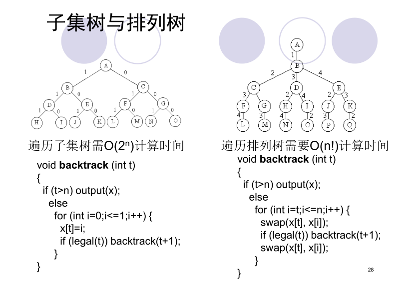

# 回溯算法框架

```c++
void backtrack (int t){
    if (t>n) output(x);
    else
        for (int i=f(n,t);i<=g(n,t);i++) {
        	x[t]=h(i);
        	if (constraint(t)&&bound(t)) backtrack(t+1);
        }
}


void iterativeBacktrack ()
{
    int t=1;
    while (t>0) {
        if (f(n,t)<=g(n,t))
            for (int i=f(n,t);i<=g(n,t);i++) {
                x[t]=h(i);
                if (constraint(t)&&bound(t)) {
                    if (solution(t)) output(x);
                    else t++;
                } //end if
            } //end for
        else t--;
    } //end while
}
```

