# 1 网络层提供的两种服务

## 虚电路服务

* 这种观点认为，应借助于电信网的成功经验，让网络负责可靠交付，计算机网络应模仿电信网络，使用**面向连接**的通信方式。

* 通信之前先建立虚电路 (Virtual Circuit)，以保证双方通信所需的一切网络资源。 

* 如果再使用可靠传输的网络协议，就可使所发送的分组无差错按序到达终点，不丢失、不重复。

**虚电路**表示这只是一条逻辑上的连接，分组都沿着这条逻辑连接按照存储转发方式传送，而并不是真正建立了一条物理连接。

**电路交换**的电话通信是先建立了一条真正的连接。

## 虚电路服务

* 网络层向上只提供简单灵活的、**无连接的、尽最大努力交付**的数据报服务。
* 网络在发送分组时不需要先建立连接。每一个分组（即 IP 数据报）独立发送，与其前后的分组无关（不进行编号）。
* **网络层不提供服务质量的承诺**。即所传送的分组可能出错、丢失、重复和失序（不按序到达终点），当然也不保证分组传送的时限。 

## 对比

| 对比的方面                 | 虚电路服务                                     | 数据报服务                                         |
| -------------------------- | ---------------------------------------------- | -------------------------------------------------- |
| 思路                       | 可靠通信应当由网络来保证                       | 可靠通信应当由用户主机来保证                       |
| 连接的建立                 | 必须有                                         | 不需要                                             |
| 终点地址                   | 仅在连接建立阶段使用，每个分组使用短的虚电路号 | 每个分组都有终点的完整地址                         |
| 分组的转发                 | 属于同一条虚电路的分组均按照同一路由进行转发   | 每个分组独立选择路由进行转发                       |
| 当结点出故障时             | 所有通过出故障的结点的虚电路均不能工作         | 出故障的结点可能会丢失分组，一些路由可能会发生变化 |
| 分组的顺序                 | 总是按发送顺序到达终点                         | 到达终点时不一定按发送顺序                         |
| 端到端的差错处理和流量控制 | 可以由网络负责，也可以由用户主机负责           | 由用户主机负责                                     |

# 2 网际协议IP

网际协议 IP 是 TCP/IP 体系中两个最主要的协议之一。

与 IP 协议配套使用的还有三个协议：

* 地址解析协议 ARP  (Address Resolution Protocol)

* 网际控制报文协议 ICMP  (Internet Control Message Protocol)
* 网际组管理协议 IGMP (Internet Group Management Protocol)

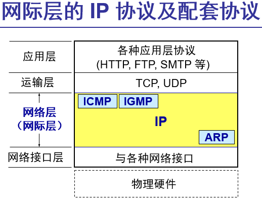

## 2.1  虚拟互连网络

**虚拟互连网络**:简而言之,就是将不同的网络,可能是无线网,卫星转发的等等,通过IP屏蔽掉,每一个都是平等的.

​			如果在这种覆盖全球的 IP 网的上层使用 TCP 协议，那么就是现在的互联网 (Internet)

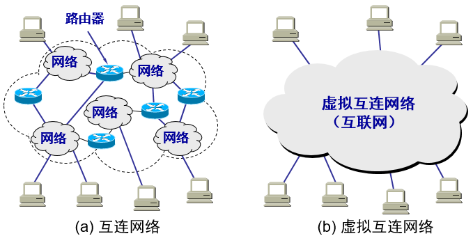

将网络互相连接起来要使用一些中间设备。 中间设备又称为中间系统或中继 (relay)系统。

有以下五种不同的中间设备：

1. 物理层中继系统：**转发器** (repeater)。
2. 数据链路层中继系统：**网桥** 或 **桥接器** (bridge)。
3. 网络层中继系统：**路由器** (router)。
4. 网桥和路由器的混合物：**桥路器** (brouter)。
5. 网络层以上的中继系统：**网关** (gateway)。  

上述五个设备中

​	当中继系统是**转发器或网桥**时(平时上课用的**集线器**也是)，一般并不称之为网络互连，因为这仅仅是**把一个网络扩大**了，而这**仍然是一个网络**

​	网络互连都是指用**路由器进行网络互连和路由选择**。

## 2.2  分类的 IP 地址

#### IP分类

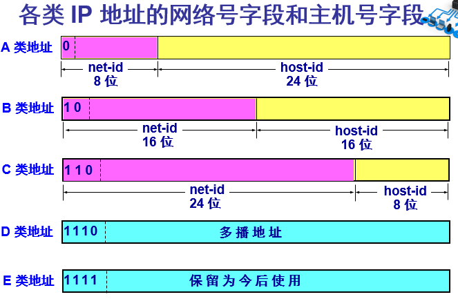

##### IP 地址的指派范围

* IP地址中的全0表示**"这个(this)"**
* 网络号全0的IP地址是保留地址,意思是**"本网络"**
* 网络号 127(01111111)保留作为本地软件**环回测试**本机的进程直接的通信之用
* 主机号全为0,代表的是本机连接到的单个网络地址(如5.6.7.8 ,对应5.0.0.0网段)
* 主机号全为1,代表的是该网段的所有主机

| 网络   类别 | 最大可指派   的网络数 | 第一个可指派的   网络号 | 最后一个可指派的   网络号 | 每个网络中   最大主机数 |
| ----------- | --------------------- | ----------------------- | ------------------------- | ----------------------- |
| A           | 126 (27 – 2)          | 1                       | 126                       | 16777214                |
| B           | 16383 (214 – 1)       | 128.1                   | 191.255                   | 65534                   |
| C           | 2097151 (221 – 1)     | 192.0.1                 | 223.255.255               | 254                     |

##### 一般不使用的特殊的 IP 地址

| 网络号 | 主机号             | 源地址   使用 | 目的地址   使用 | 代表的意思                               |
| ------ | ------------------ | ------------- | --------------- | ---------------------------------------- |
| 0      | 0                  | 可以          | 不可            | 在本网络上的本主机（见6.6节DHCP协议）    |
| 0      | host-id            | 可以          | 不可            | 在本网络上的某台主机host-id              |
| 全1    | 全1                | 不可          | 可以            | 只在本网络上进行广播（各路由器均不转发） |
| net-id | 全1                | 不可          | 可以            | 对net-id上的所有主机进行广播             |
| 127    | 非全0或全1的任何数 | 可以          | 可以            | 用作本地软件环回测试之用                 |

##### 好处

1. IP 地址是一种分等级的地址结构。分两个等级的好处是：

   ​	第一，IP 地址管理机构在分配 IP 地址时只分配网络号，而剩下的主机号则由得到该网络号的单位自行分配。这样就方便了 IP 地址的管理

   第二

   ​	路由器仅根据目的主机所连接的网络号来转发分组（而不考虑目的主机号），这样就可以使路由表中的项目数大幅度减少，从而减小了路由表所占的存储空间。

2. 实际上 IP 地址是标志一个主机（或路由器）和一条链路的接口。

   ​	当一个主机同时连接到两个网络上时，该主机就必须同时具有两个相应的 IP 地址，其网络号 net-id 必须是不同的。这种主机称为多归属主机 (multihomed host)。

   ​	由于一个路由器至少应当连接到两个网络（这样它才能将 IP 数据报从一个网络转发到另一个网络），因此一个路由器至少应当有两个不同的 IP 地址。 

3.  用转发器或网桥,集线器连接起来的若干个局域网仍为一个网络，因此这些局域网都具有同样的网络号
   net-id

4. 所有分配到网络号 net-id的网络，无论是范围很小的局域网，还是可能覆盖很大地理范围的广域网，都是平等的。

## 2.3  IP 地址与硬件地址

**硬件地址（或物理地址）**:是数据链路层和物理层使用的地址,又叫MAC地址

**IP地址**:网络层和以上各层使用的地址，是一种逻辑地址（称IP 地址是逻辑地址是因为IP 地址是用软件实现的）

## 2.4  地址解析协议 ARP

**ARP 作用**：从网络层使用的 IP 地址，解析出在数据链路层使用的硬件地址。

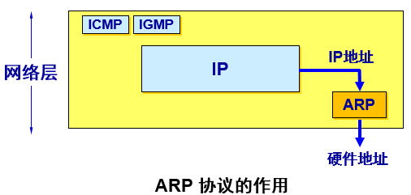

**ARP 高速缓存**:每一个主机都设有一个ARP 高速缓存(ARPcache)，里面有所在的局域网上的各主机和路由器的IP地址到硬件地址的映射表

**高速缓存的作用**

1. 存放最近获得的IP 地址到MAC 地址的绑定，以减少ARP 广播的数量
2. 为了减少网络上的通信量，主机A在发送其ARP请求分组时，就将自己的IP地址到硬件地址的映射写入ARP请求分组。
3. 当主机B收到A的ARP请求分组时，就将主机A的这一地址映射写入主机B自己的ARP高速缓存中。这对主机B以后向A发送数据报时就更方便了

**TTL (Time To Live)**：地址映射有效时间 ,数据包最多经过的路由器个数

#### ARP解析的流程

1. 当主机 A欲向本局域网上的某个主机B发送IP数据报时，就先在其ARP高速缓存中查看有无主机B的IP地址
2. 如有，就可查出其对应的硬件地址，再将此硬件地址写入MAC 帧，然后通过局域网将该MAC 帧发往此硬件地址。
3. 如没有， ARP进程在本局域网上广播发送一个 ARP 请求分组。收到ARP 响应分组后，将得到的IP 地址到硬件地址的映射写入ARP 高速缓存。
4. **注意点**:
   1. ARP 是**解决同一个局域网**上的主机或路由器的 IP 地址和硬件地址的映射问题。
   2. 如果所要找的主机和源主机不在同一个局域网上，那么就要通过 ARP 找到一个位于本局域网上的某个路由器的硬件地址，然后把分组发送给这个路由器，让这个路由器把分组转发给下一个网络。剩下的工作就由下一个网络来做。

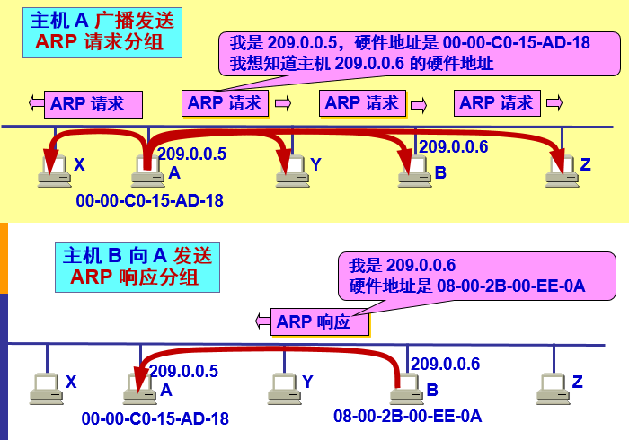

ARP请求分组：包含发送方硬件地址 / 发送方 IP 地址 / 目标方硬件地址(未知时填 0) / 目标方 IP 地址。

本地广播 ARP 请求（路由器不转发ARP请求）。

ARP 响应分组：包含发送方硬件地址 / 发送方 IP地址 / 目标方硬件地址 / 目标方 IP 地址。

ARP 分组封装在物理网络的帧中传输。

## 2.5  IP 数据报的格式

#### 一个 IP 数据报由首部和数据两部分组成

##### 首部

1. 首部的前一部分是固定长度，共 20 字节，是所有IP 数据报必须具有的
2. 在首部的固定部分的后面是一些可选字段，其长度是可变的

## 2.6  IP 层转发分组的流程

### 路由表

在路由表中，对每一条路由，最主要的是（目的网络地址，下一跳地址） 

| 目的主机所在的网络 | 下一跳地址       |
| ------------------ | ---------------- |
| 20.0.0.0           | 直接交付，接口 0 |
| 30.0.0.0           | 直接交付，接口 1 |
| 10.0.0.0           | 20.0.0.7         |
| 40.0.0.0           | 30.0.0.1         |
| 默认               | 4.0.0.1          |

### 默认路由(defaultroute)

只要找不到目标路由,则都转发到默认路由

### 注意

1. IP 数据报的首部中没有地方可以用来指明“下一跳路由器的IP地址
2. 当路由器收到待转发的数据报，不是将下一跳路由器的IP地址填入IP数据报，而是送交下层的网络接口软件。
3. 网络接口软件使用 ARP 负责将下一跳路由器的IP地址转换成硬件地址，并将此硬件地址放在链路层的MAC帧的首部，然后根据这个硬件地址找到下一跳路由器。  

# 3  划分子网和构造超网

## 3.1  划分子网

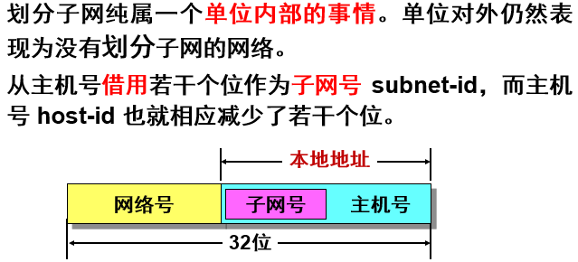

### 子网掩码

1. 从一个 IP 数据报的首部并无法判断源主机或目的主机所连接的网络是否进行了子网划分。使用子网掩码(subnet mask)可以找出 IP 地址中的子网部分
2. 某位＝1：IP地址中的对应位为网络号和子网号
3. 某位＝0：IP地址中的对应位为主机号

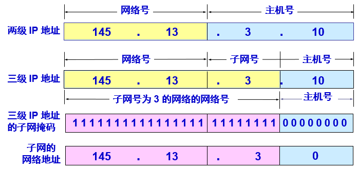

### 默认子网掩码

A类地址:255.0.0.0

B类地址:255.255.0.0

C类地址:255.255.255.0

## 3.2  使用子网时分组的转发

转发的时候,要先将IP地址与各个网段的子网掩码相与,符合才跳到相应的网段

| 目的网络地址  | 子网掩码        | 下一跳 |
| ------------- | --------------- | ------ |
| 128.30.33.0   | 255.255.255.128 | 接口 0 |
| 128.30.33.128 | 255.255.255.128 | 接口 1 |
| 128.30.36.0   | 255.255.255.0   | R2     |

## 3.3  无分类编址 CIDR（构造超网）

**无分类域间路由选择** CIDR(Classless Inter-Domain Routing)

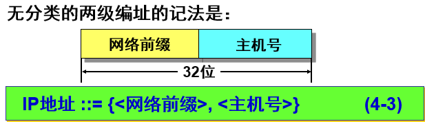

### 特点

1. CIDR 消除了传统的 A 类、B 类和 C 类地址以及划分子网的概念，因而可以更加有效地分配 IPv4 的地址空间。
2. CIDR使用各种长度的“网络前缀”(network-prefix)来代替分类地址中的网络号和子网号。
3. IP 地址从三级编址（使用子网掩码）又回到了两级编址。  

### 用法

CIDR 使用“**斜线记法**”(slashnotation)，它又称为 **CIDR 记法**，即在 IP地址面加上一个斜线“/”，然后写上网络前缀所占的位数（这个数值对应于三级编址中子网掩码中1的个数）。例如： **220.78.168.0/24**

### CIDR地址块

* CIDR 把**网络前缀都相同的连续的IP地址组成“CIDR 地址块”**
* 128.14.32.0/20 表示的地址块共有212 个地址（因为斜线后面的20 是网络前缀的位数，所以这个**地址的主机号是12位**）
* 全 0 和全 1 的主机号地址一般不使用。

## 3.4 路由聚合(routeaggregation) 

1. 路由聚合也称为构成超网(supernetting)
2. CIDR 虽然不使用子网了，但仍然使用“掩码”这一名词（但不叫子网掩码）

### 构成超网

前缀长度不超过 23位的CIDR地址块都包含了多个C 类地址。

这些 C 类地址合起来就构成了超网。

**CIDR 地址块中的地址数一定是2 的整数次幂。**

网络前缀越短，其地址块所包含的地址数就越多。而在三级结构的IP地址中，划分子网是使网络前缀变长。

CIDR 的一个好处是：可以更加有效地分配 IPv4 的地址空间，可根据客户的需要分配适当大小的 CIDR 地址块。  

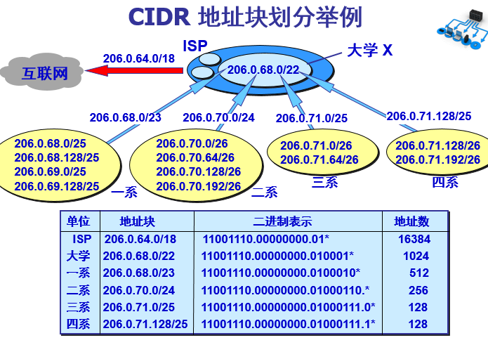

### 最长前缀匹配

使用 CIDR 时，路由表中的每个项目由“网络前缀”和“下一跳地址”组成。在查找路由表时可能会得到不止一个匹配结果。 

应当从**匹配结果中选择具有最长网络前缀的路由**：最长前缀匹配 (longest-prefix matching)。

网络前缀越长，其地址块就越小，因而路由就越具体 (more specific) 。

最长前缀匹配又称为最长匹配或最佳匹配。

### 二叉线索查找路由表

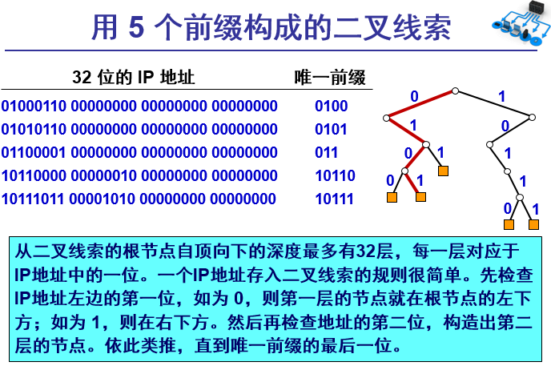

# 4  网际控制报文协议 ICMP

## 4.1  ICMP 报文的种类

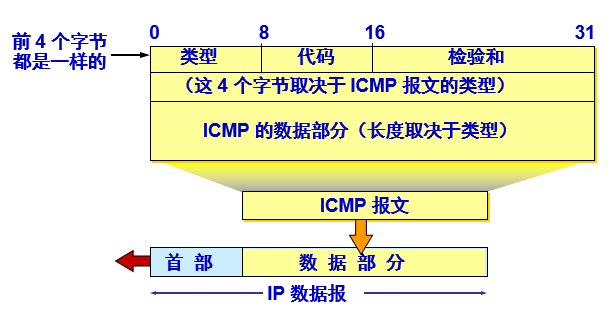

#### ICMP 差错报告报文 

有四种:

​	**终点不可达** 

​	**时间超过** 

​	**参数问题** 

​	**改变路由（重定向）(Redirect)**  

不发送差错报文的情况

​	对 ICMP 差错报告报文不再发送 ICMP 差错报告报文。

​	对第一个分片的数据报片的所有后续数据报片都不发送 ICMP 差错报告报文。

​	对具有多播地址的数据报都不发送 ICMP 差错报告报文。

​	对具有特殊地址（如127.0.0.0 或 0.0.0.0）的数据报不发送 ICMP 差错报告报文。

#### ICMP询问报文

有两种:

​	回送请求和回答报文

​	时间戳请求和回答报文

## 4.2  ICMP 的应用举例

### PING (PacketInterNetGroper) 

​	PING 用来测试两个主机之间的连通性。

​	PING 使用了 ICMP 回送请求与回送回答报文。

​	PING 是应用层直接使用网络层 ICMP 的例子，它没有通过运输层的 TCP 或UDP。 

### Traceroute

​	在 Windows 操作系统中这个命令是 tracert。

​	用来跟踪一个分组从源点到终点的路径。

​	它利用 IP 数据报中的 TTL 字段和 ICMP 时间超过差错报告报文实现对从源点到终点的路径的跟踪。

# 5  互联网的路由选择协议

## 5.1  有关路由选择协议的几个基本概念

### 自治系统 AS(Autonomous System) 

•自治系统 AS 的定义：在单一的技术管理下的一组路由器，而这些路由器使用一种 AS 内部的路由选择协议和共同的度量以确定分组在该 AS 内的路由，同时还使用一种 AS 之间的路由选择协议用以确定分组在 AS之间的路由。

•现在对自治系统 AS 的定义是强调下面的事实：尽管一个 AS 使用了多种内部路由选择协议和度量，但重要的是一个 AS 对其他 AS 表现出的是一个单一的和一致的路由选择策略。

### 内部网关协议 IGP (Interior Gateway Protocol)  

​	在一个自治系统内部使用的路由选择协议。

​	目前这类路由选择协议使用得最多，如 RIP 和 OSPF 协议。

### 外部网关协议 EGP (External Gateway Protocol) 

​	若源站和目的站处在不同的自治系统中，当数据报传到一个自治系统的边界时，就需要使用一种协议将路由选择信息传递到另一个自治系统中。这样的协议就是外部网关协议 EGP。

​	在外部网关协议中目前使用最多的是 BGP-4。  

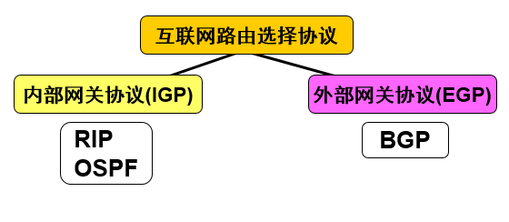

## 5.2  内部网关协议 RIP

****

### 工作原理

**在分组转发的时候,选择最短距离的路由**

路由信息协议 RIP (Routing Information Protocol) 是内部网关协议 IGP 中最先得到广泛使用的协议。

RIP 是一种**分布式的、基于距离向量的路由选择协议**。

RIP 协议要求网络中的每一个路由器都要维护从它自己到其他每一个目的网络的距离记录。 

### RIP协议的三个特点

​	(1) 仅和相邻路由器交换信息。 

​	(2) 交换的信息是当前本路由器所知道的全部信息，即自己的路由表。 

​	(3) 按固定的时间间隔交换路由信息，例如，每隔 30 秒。当网络拓扑发生变化时，路由器也及时向相邻路由器通告拓扑变化后的路由信息。

### 更新算法

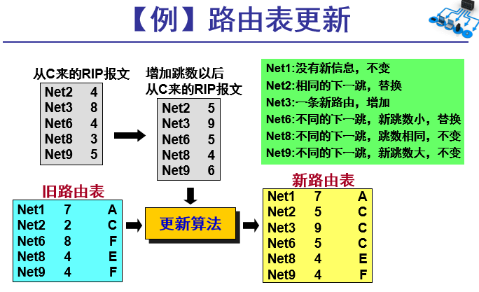

### **优点：**

​	实现简单，开销较小。

### **缺点：**

​	RIP 限制了网络的规模，它能使用的最大距离为 15（16 表示不可达）。

​	路由器之间交换的路由信息是路由器中的完整路由表，因而随着网络规模的扩大，开销也就增加。 

​	“坏消息传播得慢”，使更新过程的收敛时间过长。

## 5.3  内部网关协议 OSPF

## 5.4  外部网关协议 BGP

## 5.5  路由器的构成