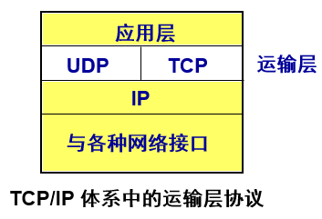
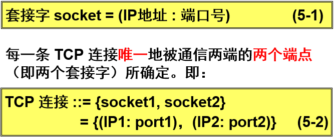
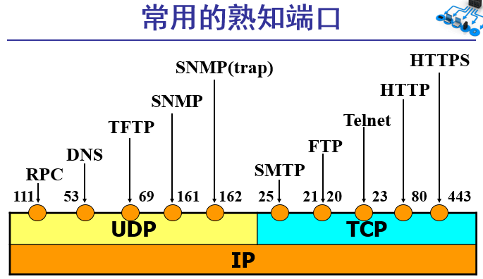

# 运输层

## 用户数据报协议UDP (UserDatagramProtocol)

**一种无连接协议**

1. 提供无连接服务。
2. 在传送数据之前不需要先建立连接。
3. 传送的数据单位协议是 UDP 报文或用户数据报。
4. 对方的运输层在收到 UDP 报文后，不需要给出任何确认。
5. 虽然 UDP 不提供可靠交付，但在某些情况下 UDP 是一种最有效的工作方式。

### 概述

* UDP 只在 IP 的数据报服务之上增加了很少一点的功能：

  * 复用和分用的功能

  * 差错检测的功能

* 虽然 UDP 用户数据报只能提供不可靠的交付，但 UDP 在某些方面有其特殊的优点。

### 特点

(1) **UDP 是无连接的**，发送数据之前不需要建立连接，，因此减少了开销和发送数据之前的时延。

(2) **UDP 使用尽最大努力交付**，即不保证可靠交付，因此主机不需要维持复杂的连接状态表。

(3) **UDP 是面向报文的**。UDP 对应用层交下来的报文，既不合并，也不拆分，而是保留这些报文的边界。UDP 一次交付一个完整的报文。

(4) **UDP 没有拥塞控制**，因此网络出现的拥塞不会使源主机的发送速率降低。这对某些实时应用是很重要的。很适合多媒体通信的要求。 

(5) **UDP 支持一对一、一对多、多对一和多对多**的交互通信。

(6) **UDP 的首部开销小**，只有 8 个字节，比 TCP 的 20 个字节的首部要短。

## 传输控制协议 TCP(TransmissionControl Protocol)

**一种面向连接的协议**

1. 提供面向连接的服务。
2. 传送的数据单位协议是 TCP 报文段 (segment)。
3. **TCP 不提供广播或多播服务。**
4. 由于 TCP 要提供可靠的、面向连接的运输服务，因此不可避免地增加了许多的开销。这不仅使协议数据单元的首部增大很多，还要占用许多的处理机资源。

### 特点

* TCP 是面向连接的运输层协议。
* 每一条 TCP 连接只能有两个端点 (endpoint)，每一条 TCP 连接只能是点对点的（一对一）。 
* TCP 提供可靠交付的服务。
* TCP 提供全双工通信。
* 面向字节流
  * TCP 中的“流”(stream)指的是流入或流出进程的字节序列。
  * “面向字节流”的含义是：虽然应用程序和 TCP 的交互是一次一个数据块，但 TCP 把应用程序交下来的数据看成仅仅是一连串无结构的字节流。

### 连接

* TCP 把连接作为最基本的抽象。
* 每一条 TCP 连接有两个端点。
* TCP 连接的端点不是主机，不是主机的IP 地址，不是应用进程，也不是运输层的协议端口。TCP 连接的端点叫做套接字 (socket) 或插口。
* 端口号拼接到 (contatenated with) IP 地址即构成了套接字。   

### 可靠传输的工作原理

#### 停止等待协议

“停止等待”就是每发送完一个分组就停止发送，等待对方的确认。在收到确认后再发送下一个分组。

#### 自动重传请求 ARQ

* 通常 A 最终总是可以收到对所有发出的分组的确认。如果 A 不断重传分组但总是收不到确认，就说明通信线路太差，不能进行通信。
* 使用上述的确认和重传机制，我们就可以在不可靠的传输网络上实现可靠的通信。
* 像上述的这种可靠传输协议常称为自动重传请求 ARQ  (Automatic Repeat reQuest)。意思是重传的请求是自动进行的，接收方不需要请求发送方重传某个出错的分组。

#### 连续ARQ 协议

* 滑动窗口协议比较复杂，是 TCP 协议的精髓所在。
* 发送方维持的发送窗口，它的意义是：位于发送窗口内的分组都可连续发送出去，而不需要等待对方的确认。这样，信道利用率就提高了。
* 连续 ARQ 协议规定，发送方每收到一个确认，就把发送窗口向前滑动一个分组的位置。

## 软件端口和硬件端口

**因为不同操作系统的进程标识符是不一样的,所以在在运输层传输数据包的时候,要带上IP和端口号,这样就就可以和监听对应端口的进程通信.**

1. 两个不同的概念。
2. 在协议栈层间的抽象的协议端口是软件端口。
3. 路由器或交换机上的端口是硬件端口。
4. 硬件端口是不同硬件设备进行交互的接口，而软件端口是应用层的各种协议进程与运输实体进行层间交互的一种地址。 

